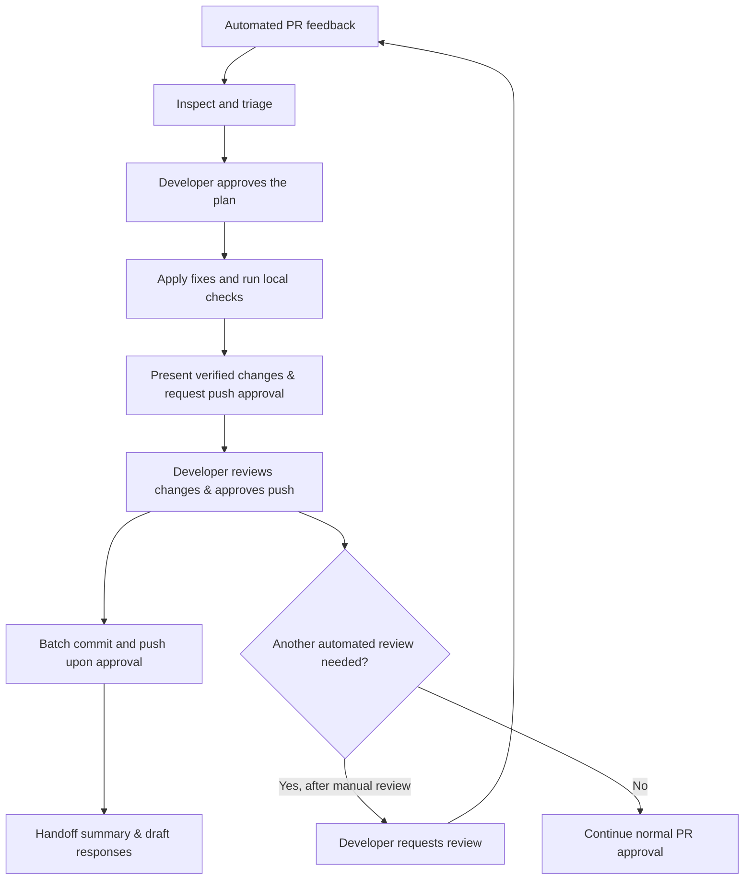

# Automated PR feedback and AI-assisted fixes

Automated PR reviews help catch issues early and reduce review overhead.
Our `pr-agent` configuration is tuned to provide useful, context-aware
feedback rather than generic suggestions. Its comments are more often
useful than not—but they still need to be evaluated.

Reading and understanding the feedback yourself is always worthwhile.
In practice, it is often more efficient to let a local AI assistant take
the first pass. The `address-pr-feedback` skill handles that work:
inspecting comments, assessing suggestions against repository conventions,
and preparing verified fixes.

**The developer remains the decision-maker. A second automated review
must only happen after manual review of the changes.**

## How to approach automated feedback

Treat comments from PR-Agent and SonarQube / SonarCloud as review input,
not instructions to follow unconditionally.

Start by checking whether the comment identifies a real issue. Then
assess whether the proposed solution fits the implementation, repository
conventions, and scope of the PR.

A useful first pass should:

- Fix valid issues with focused changes.
- Explain why a suggestion does not apply when there is a concrete reason.
- Escalate ambiguous or high-risk decisions.
- Report what was changed, what was verified, and what still needs review.

The goal is better code—not accepting every suggestion or finding a
reason to reject every comment.

### Check suggestions against repository context

Automated reviewers can miss details that matter in this codebase:

- **Angular conventions.** Suggestions should account for our Angular 21
  signal-based APIs, such as `input()` and `output()`, and native control
  flow, such as `@if` and `@for`.
- **Application architecture.** Changes should respect our Tailwind CSS
  conventions, offline-first RxDB/Dexie data flows, and i18n system.
- **Review scope.** Cosmetic changes and arbitrary refactors may fall
  outside the guidance in
  [`.pr_agent.toml`](https://github.com/e-picsa/picsa-apps/blob/master/.pr_agent.toml).
- **Static-analysis configuration.** Check findings against
  `sonar-project.properties`, including applicable rule exclusions such
  as `typescript:S2933` for injected services.

A convention mismatch may invalidate the proposed fix without
invalidating the underlying issue. Where possible, address the issue
using an approach that fits the repository.

> **Review rule:** Do not blindly accept automated suggestions. If a
> recommendation conflicts with repository standards, explain the
> conflict and propose an appropriate alternative where needed.

## The `address-pr-feedback` skill

The skill is stored at `.agent/skills/address-pr-feedback/SKILL.md`,
with symlinks under `.agents/skills` and `.gemini/skills`.

Use it from an AI assistant working on the relevant branch or worktree.
The invocation syntax depends on the tool; the workflow does not.

The skill follows five phases:

1. **Inspect and check freshness.** Fetch PR details, review comments, and
   CI checks using GitHub CLI. Verify that PR-Agent review comments reflect
   the current branch commit before proceeding.
2. **Triage.** Classify feedback as accept, push back, or escalate.
3. **Plan.** Present the proposed changes and obtain developer approval.
4. **Implement and verify.** Apply focused fixes and run local checks.
5. **Deliver upon approval.** Present verified changes to the developer;
   commit and push only upon explicit confirmation, and draft review responses.

Approval of the plan is not approval of the resulting code. The
developer still reviews the implementation before requesting another
automated pass.



### Triage decisions

| Decision | When to use it | Expected action |
| --- | --- | --- |
| **Accept and fix** | A verified bug, missing error handling, test failure, security issue, or valid quality-gate finding. | Make a focused fix, add tests where appropriate, and verify the result. |
| **Push back** | The suggestion does not apply, conflicts with repository policy, or introduces unnecessary changes. | Explain the technical reason, citing relevant code or policy. Offer a compatible fix if the underlying concern is valid. |
| **Escalate** | The change affects architecture, breaks a public API, or involves an unclear trade-off. | Present the options and ask the developer to decide before proceeding. |

A failing quality gate needs investigation, not automatic acceptance of
every proposed fix. Likewise, a suppressed rule does not prove that the
underlying code is correct.

## Keep a human checkpoint between automated reviews

**Never let the PR reviewer and local AI assistant iterate unattended
until they agree.**

Two AI systems reaching agreement is not a correctness check. They can
reinforce the same misunderstanding, introduce unnecessary changes, or
spend repeated passes debating low-value suggestions. These loops can
also be costly and token-inefficient.

Before requesting another automated review:

- Read the diff and confirm the intended behavior is preserved.
- Review the reasoning for accepted and rejected feedback.
- Resolve any escalated questions.
- Check verification results and note anything that was not run.
- Make sure the changes remain within the PR's scope.

If further changes are needed, make them yourself or ask the assistant
to revise its work. Review the updated result before requesting
another automated pass.

### Workflow safeguards

The workflow uses several safeguards to keep iteration deliberate.

#### Pushes do not automatically trigger PR-Agent reviews

In
[`.github/workflows/pr-agent.yml`](https://github.com/e-picsa/picsa-apps/blob/master/.github/workflows/pr-agent.yml),
`github_action_config.handle_push_trigger` is set to `'false'`.

PR-Agent runs on the initial PR open or through an explicit request,
such as `/review` or `/improve`, rather than reviewing every pushed
commit.

This setting applies to PR-Agent. Other CI checks may still run on push.

#### Re-review stays in developer hands

The skill must not post `/review` or `/improve` automatically.

After completing its work, the assistant should hand control back to
the developer—not immediately request more feedback.

#### Commit and push require explicit developer approval

The assistant must not push changes automatically to the remote repository.
Local changes and verification results must be presented first, making
commit and push conditional on developer confirmation.

#### Verification happens locally before pushing

Run the affected lint and test targets:

```bash
yarn nx affected --target=lint
yarn nx affected --target=test
```

Confirm that the affected range covers the PR changes. Run additional
checks where the changes warrant them.

If a check fails or cannot run, report it clearly. Do not describe the
changes as verified when validation is incomplete.

#### Fixes are delivered as a batch

Batch accepted fixes into a single commit rather than pushing after
each comment. The standard commit message is:

```text
fix: address PR review feedback [pr-agent/sonar]
```

This reduces partial review states and unnecessary CI churn.

#### Another review is optional, not automatic

After manual review, the developer can request another PR-Agent pass
by commenting `/review` on GitHub.

Once that run finishes, invoke `address-pr-feedback` again if there is
new feedback to address. The same human checkpoint applies to every
subsequent pass.

This process complements normal PR approval requirements; it does not
replace them.

## Using the skill

Open your AI assistant in the branch or worktree associated with the PR.
Make sure GitHub CLI is authenticated and has access to the repository.

Use the skill name directly, or your assistant's supported skill
invocation syntax.

### Triage only

Use this when you want to understand the feedback before authorizing
changes.

> Use the `address-pr-feedback` skill to inspect this PR's review
> comments and CI checks. Present a triage table with proposed fixes,
> reasons for pushing back, and questions that need my input. Do not
> modify code, post replies, or push changes yet.

Expected output:

- A summary of relevant comments and failing checks.
- An accept, push-back, or escalate decision for each item.
- A proposed implementation and verification plan.

### Triage, implement, and verify

Use this to delegate the first pass while retaining approval of the
plan.

> Use `address-pr-feedback` on this branch. Inspect the feedback and
> present a triage plan for approval. Once approved, implement valid
> fixes, run the relevant local checks, and batch the changes into a
> single commit and push. Summarize the changes and draft responses for
> rejected suggestions. Do not request another automated review.

The assistant should finish with a handoff covering:

- Changes made and the comments they address.
- Feedback left unaddressed, with reasons.
- Checks run and their results.
- Any remaining risks or decisions.
- Drafted or posted replies, clearly distinguished.
- A reminder to review the diff before requesting another review.

### Assess a specific suggestion

Use this when a comment appears to conflict with repository conventions.

> Assess the PR-Agent comment suggesting an `@Input()` decorator.
> Check whether the underlying concern is valid and whether a
> signal-based input is appropriate under our Angular conventions.
> Draft a concise response citing the relevant guidance. Do not post
> it or change code yet.

Relevant guidance is available in the
[Angular skill](https://github.com/e-picsa/picsa-apps/blob/master/.agent/skills/angular/SKILL.md).

Prefer a specific technical explanation over a blanket dismissal of
the reviewer.

## Helpful CLI commands

Run these commands from the relevant branch or worktree.

### Inspect PR details

```bash
gh pr view --json number,url,title,headRefName
```

### Read PR-level comments

PR-Agent summaries may appear as top-level PR comments.

```bash
gh pr view --json comments \
  --jq '.comments[] | {author: .author.login, body: .body}'
```

### Read inline review comments

```bash
repo="$(gh repo view --json nameWithOwner -q .nameWithOwner)"
pr_number="$(gh pr view --json number -q .number)"

gh api --paginate "repos/${repo}/pulls/${pr_number}/comments" \
  --jq '.[] | {
    id: .id,
    path: .path,
    line: .line,
    author: .user.login,
    body: .body
  }'
```

### Check CI status

```bash
gh pr checks
```

### Reply to an inline review comment

Use the inline comment ID returned by the review-comments command.
Review the response text before posting.

```bash
repo="$(gh repo view --json nameWithOwner -q .nameWithOwner)"
pr_number="$(gh pr view --json number -q .number)"

read -r -p "Inline review comment ID: " comment_id
read -r -p "Reply text: " reply_body

gh api \
  "repos/${repo}/pulls/${pr_number}/comments/${comment_id}/replies" \
  -f body="$reply_body"
```

This endpoint replies to inline review comments, not top-level PR
comments.

## Key takeaways

- **PR-Agent is useful, not infallible.** Its feedback deserves
  consideration, not unconditional acceptance.
- **Local AI is an efficient first pass.** Use `address-pr-feedback`
  to assess comments and prepare focused, verified fixes.
- **Manual review is mandatory before another automated pass.**
  Keep the developer in control, and never use AI-to-AI agreement as
  the completion criterion.