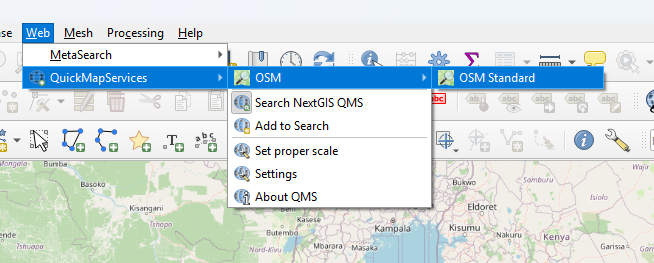
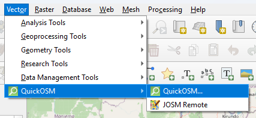
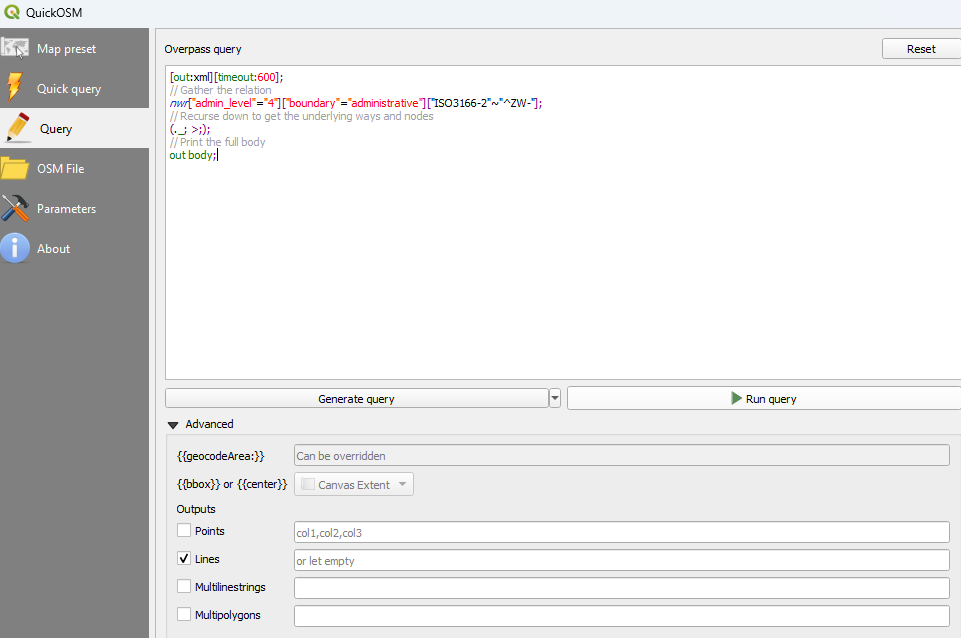
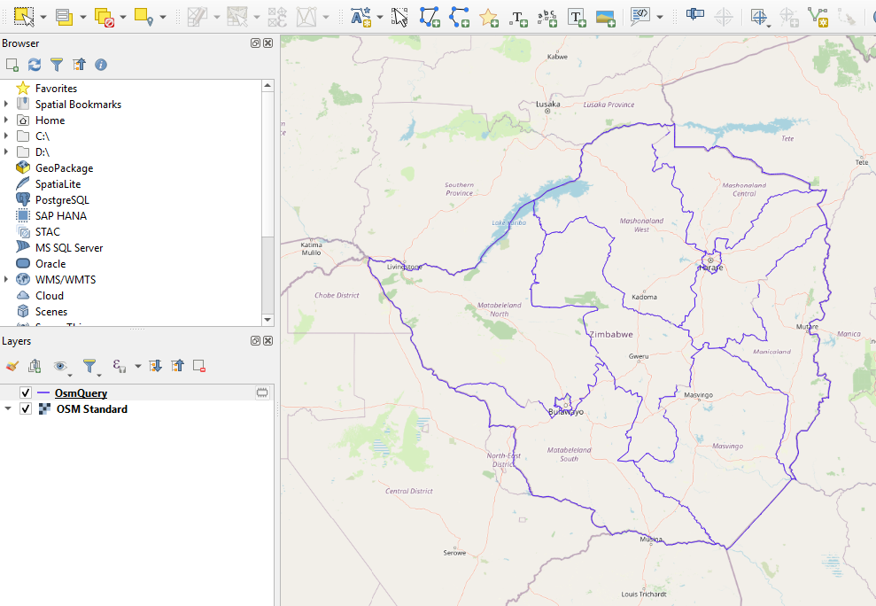
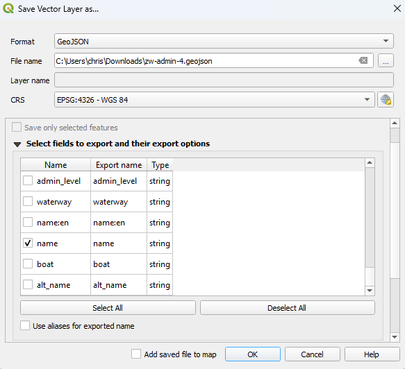

# Map Tiles

When generating a new deployment hardcoded map tiles should be exported so that they are immediately available to new app users
All data is generated from [OpenStreetMap](https://www.openstreetmap.org/), using the [OverpassTurbo Api](https://overpass-turbo.eu/index.html)

Example data exploration
https://www.openstreetmap.org/relation/195290

For details about administrative levels
https://wiki.openstreetmap.org/wiki/Tag:boundary%3Dadministrative

## Setup QGIS

1. Download and install

2. Create a new project

3. Go to `Plugins` -> `Install` and install the `QuickMapServices`, `QuickOSM` and `QMapShaper` plugins

## Add Basemap

Go to `Web` -> `QuickMapServices` -> `OSM` -> `OSM Standard`



You should now have a zoomable basemap

## Add Administrative Boundaries

Go to `Vector` -> `QuickOSM` -> `QuickOSM`



Create a new `Query` to generate administrative boundaries.
Use the [ISO3166-2](https://en.wikipedia.org/wiki/ISO_3166-2) code to filter by country.

```overpassql
[out:xml][timeout:600];
// Gather the relation
nwr["admin_level"="4"]["boundary"="administrative"]["ISO3166-2"~"^ZW-"];
// Recurse down to get the underlying ways and nodes
(._; >;);
// Print the full body
out body;
```

Use `Advanced` to select only `Lines`



Click `Run Query`

This should update the QGIS map with a new `OSMQuery` layer that shows outlined regions



## Export GeoJson
_Right-Click_ the layer and select `Export` -> `Save Features As`

Use the dialog to provide an output file location

Deselect all fields except for `name`



Save the geojson file

## Convert to TopoJson

Files up to 10MB can be converted online using:
https://mygeodata.cloud/converter/geojson-to-topojson

Larger files may first need to be optimised locally first (e.g. removing metadata fields), or converted via local scripts

----

# Future TODOs

It should be possible to integrate a single serverless function into the dashboard to handle all processing.

It can call the overpassApi directly and use mapshaper to convert geojson to topojson

---

# Legacy Docs

{/* To Migrate */}

### Admin 5 data

**Admin_5 - District/Province Boundaries**
OSM does not keep relations between admin_4 and admin_5, so it is not possible to retrieve all admin_5
boundaries with a single query.

Instead wiki entries must be used to manually extract one at a time

In some cases original sources for boundaries are provided, however these have likely undergone several revisions since
first population, and so are unlikely to be representative of current map as viewed in OSM

It may be possible to try and use common tags found across multiple boundaries, e.g.

```overpassql
[out:json][timeout:25];
// gather results
nwr["admin_level"="5"]["boundary"="administrative"]["source"="https://github.com/lightonphiri/data-zambia-shapefiles"];

// print results
out geom;
```

Otherwise will likely need to create a search limited to country bounding box and filter out results that are not part of country
Use web viewport bounding box via `{{bbox}}` query, or specify coordinates for custom bounding box

```overpassql
[out:json][timeout:25];
// gather results
nwr["admin_level"="5"]["boundary"="administrative"]["type"="boundary"]({{bbox}});

// print results
out geom;
```

http://bboxfinder.com/#-18.271086,21.379395,-7.863382,34.453125
21.379395, -18.271086, 34.453125, -7.863382
West South East North

Convert WSEN -> SWNE coordinates

-18.271086, 21.379395, -7.863382, 34.453125
South West North East


### Optimise
Use the scripts in this workspace to convert geoJson to boundaries to retain only minimal information required for use in the app

## Troubleshooting

### Duplicate entries

There may be some cases where the data exported from QGIS includes errors, which can result in duplicate entries (e.g. malawi data incorrectly marks the Karonga district as Chipita).

Review the exported data and cross-check external sources, e.g.

https://en.wikipedia.org/wiki/List_of_administrative_divisions_by_country

https://data.humdata.org/dataset/?dataseries_name=COD+-+Subnational+Administrative+Boundaries

## Additional Notes

Consider further reductions with https://mapshaper.org/