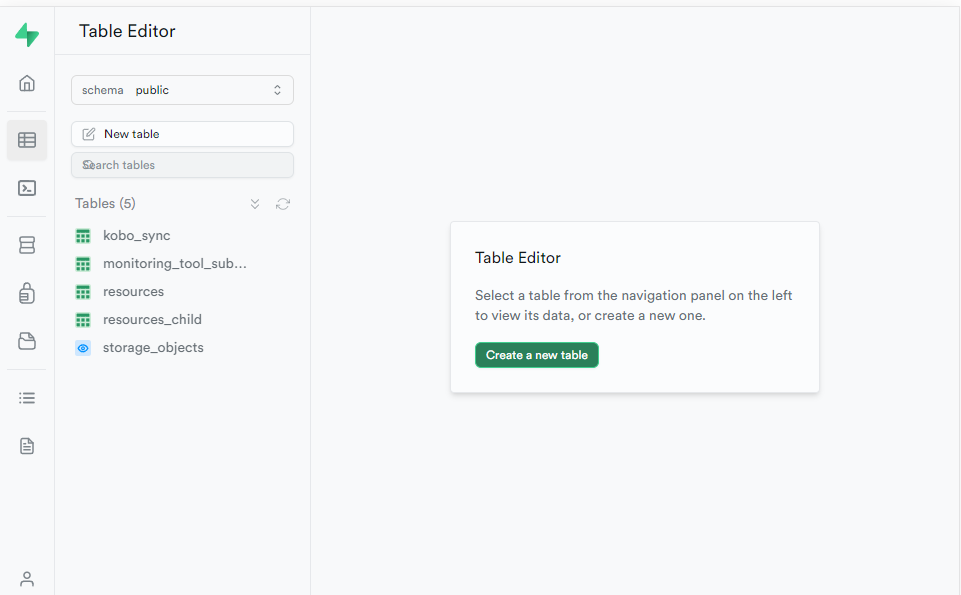
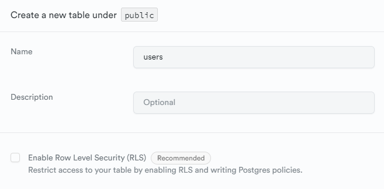
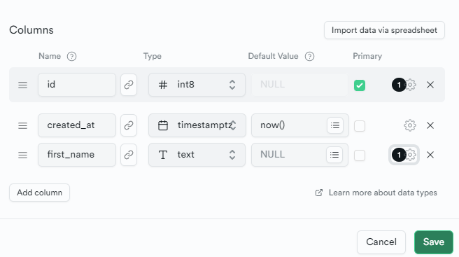
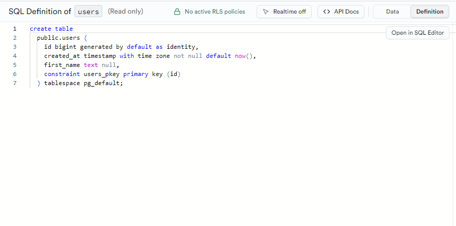

# Create tables

## Generate new table

This can be achieved interactively using the supabase studio (assumed running locally)  
http://localhost:54323/project/default/editor



For ease of testing, you will likely want to opt out of `Row Level Security`. Permissions can be configured at a later stage



## Define Schema

Using the interactive interface define data columns for your table



## Export definition

Once a table has been created, the definition needs to be stored to enable recreation on bootstrap and update.

1. Create a migration file to store the definition update.

```sh
yarn nx run picsa-server:supabase migration new [migration_name]
```

Providing a clear name for the migration. E.g. if creating a new table to store `users`:

```sh
yarn nx run picsa-server:supabase migration new users_table_create
```

This will populate a new file to `apps\picsa-server\supabase\migrations`.

2. Copy the table definition to the migration
   The definition can be found in the UI using the `Definition` tab in the top-right corner



## Export Seed Data

It is often useful to include some example data to use for development.

Any data that has been generated locally can be exported as CSV directly from the supabase dashboard.
Select rows for export and select **Export to CSV**.


This data should be placed in the `apps\picsa-server\supabase\data` folder.

Seed data can then be imported via

```sh
yarn nx run picsa-server:seed
```
