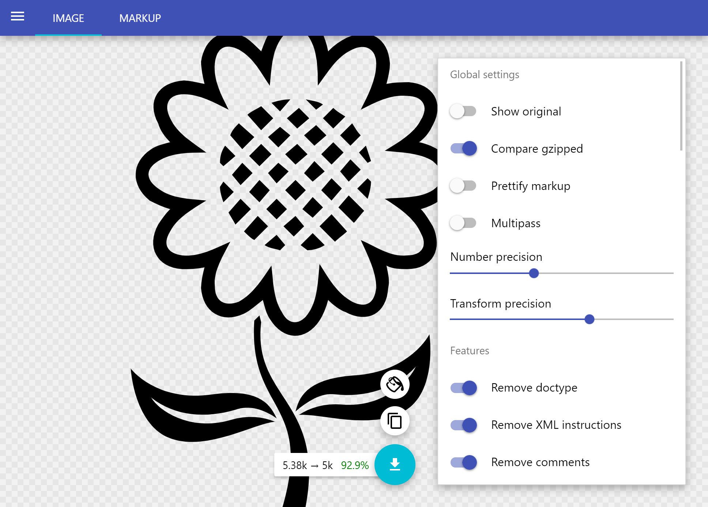

import { Callout } from "nextra/components";

# Assets

## SVG Optimisation

Many of the images used are vector svg files. When first generated or downloaded these may contain significant amounts of metadata or similar bloat increasing file size.
It is recommended that before adding to the project any svg files are passed through the default settings of the tool:
https://jakearchibald.github.io/svgomg/

_Example - Using SVGOMG default settings can reduce svg size by more than 90%_


## Sharing across tools

All tools contain their own assets folders, however there may be times when it is useful to use the same assets across multiple apps.

Angular supports a system so that assets from one location can be copied into another on compile.
Whilst this could copy directly from any app to any other, as a convention we prefer to place shared assets in the `libs/shared-assets` folder and copy from there.

For example, to copy the share crop svg images to

```json filename="apps/picsa-tools/budget-tool/project.json"
{
  "name": "picsa-tools-budget-tool",
  "targets": {
    "build": {
      "options": {
        "assets": [
          {
            "glob": "*.svg",
            "input": "libs/shared-assets/svgs/crops/",
            "output": "assets/svgs/crops/"
          }
        ]
      }
    }
  }
}
```

<Callout emoji="💡">
  **Tip** Wherever possible tool assets should try to match the folder structure
  of shared-assets when importing. E.g. in the example above both sets of assets
  are populated to `/svgs/crops` child asset folder
</Callout>

Further documentation on asset configuration can be found at: https://angular.io/guide/workspace-config#assets-configuration

## Sharing across apps

In addition to sharing with individual tools, shared assets should also be configured for any apps that import the tools (i.e. main extension app).  
This will be handled by adding an entry to copy the tool assets into the main app, e.g.

```json filename="apps/picsa-apps/app/project.json"
{
  "name": "picsa-apps-app",
  "targets": {
    "build": {
      "options": {
        "assets": [
          {
            "glob": "**/*",
            "input": "libs/shared-assets/",
            "output": "assets"
          },
          {
            "glob": "**/*",
            "input": "apps/picsa-tools/budget-tool/src/assets/",
            "output": "assets/"
          },
          {
            "glob": "**/*",
            "input": "apps/picsa-tools/climate-tool/src/assets/",
            "output": "assets/"
          }
        ]
      }
    }
  }
}
```

<Callout type="warning" emoji="⚠️">
  As assets from multiple tools and the shared-assets folder are imported into
  the extension app, it is possible for assets from one tool to accidentally
  overwrite another if they have the same path, e.g. `assets/images/home.png`
  <hr />
  It is recommended to try and keep tool-specific assets in named folders, such
  as `assets/budget-images/main.png`
</Callout>

### Different asset folder structures

If a tool imports shared assets but changes the folder structure, additional entry should be included in the app asset configuration.

E.g. If in the tool-sharing example assets where actually copied to a different `budget-cards` folder:

```json filename="apps/picsa-tools/budget-tool/project.json"
{
  "name": "picsa-tools-budget-tool",
  "targets": {
    "build": {
      "options": {
        "assets": [
          {
            "glob": "*.svg",
            "input": "libs/shared-assets/svgs/crops/",
            "output": "assets/budget-cards/"
          }
        ]
      }
    }
  }
}
```

The extension app will require additional configuration to reflect this (resulting in a small amount of asset duplication)

```json filename="apps/picsa-apps/app/project.json"
{
  "name": "picsa-apps-app",
  "targets": {
    "build": {
      "options": {
        "assets": [
          {
            "glob": "**/*",
            "input": "libs/shared-assets/",
            "output": "assets"
          },
          {
            "glob": "**/*",
            "input": "libs/shared-assets/svgs/crops/",
            "output": "assets/budget-cards/"
          }
        ]
      }
    }
  }
}
```

Therefore it is recommended to maintain folder structures from shared assets when possible
