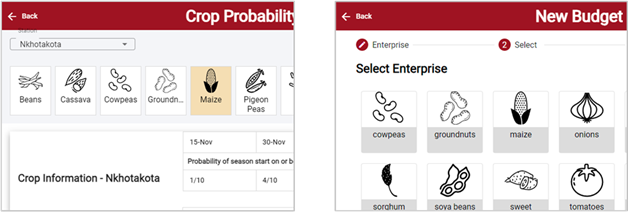
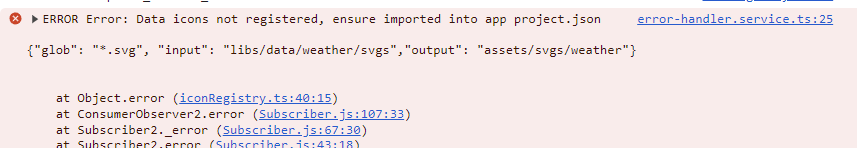

import { Callout } from "nextra-theme-docs";

# Data Sharing

The `libs/data` library should be used for any hardcoded data that needs to be used across multiple apps,



_Example: Budget, Crop Probability and Seasonal Calendar tools all include lists of crops_

## Data with Icons

Any file assets linked from data will also need to be manually imported into projects, using the `project.json`
to copy assets into local build and referencing from the `MatIconRegistry`

<Callout emoji="💡">
  **Tip** The documentation on [Assets](./assets.mdx) and [Material
  Icons](./icons.mdx) goes into more detail on this, however the data lib
  contains utility methods to simplify the process.
</Callout>

### Import assets

Assest related to a specific set of data should be placed in a nested child folder,
e.g. svg icons related to weather data are placed in `libs/data/weather/svgs`

These folders should then be remapped to the project asset folder, using the `assets/svgs` folder by convention, i.e.

```json
{ "glob": "*.svg", "input": "libs/data/weather/svgs", "output": "assets/svgs/weather" },
```

### Register custom mat-icons

A utility `DataIconRegistry` service has been created to facilitate the process of registering custom mat icons,
simply import the service and specify the set of data icons for registration

```ts
import { DataIconRegistry } from '@picsa/data';

constructor(dataIconRegistry: DataIconRegistry){
 dataIconRegistry.registerMatIcons('weather');
}
```

All icons will be added to a namespace prefixed by `picsa`, e.g. `picsa_weather`.
These can be referenced from frontend code using the `svgIcon` identifier. E.g. `rain` icon:

```html
<mat-icon svgIcon="picsa_weather:rain" />
```

---

<Callout emoji="💡">
  **Tip** If icons have not been imported you should see a helpful console error
  to inform of missing imports
</Callout>

