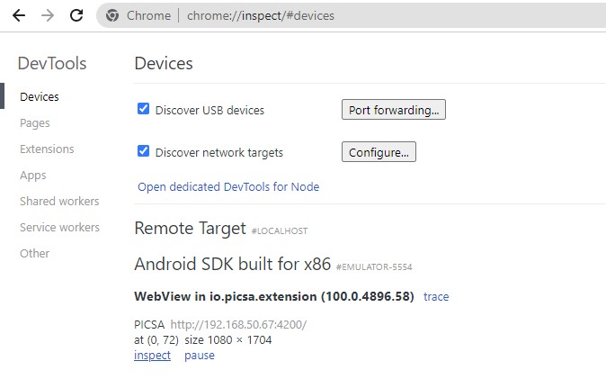
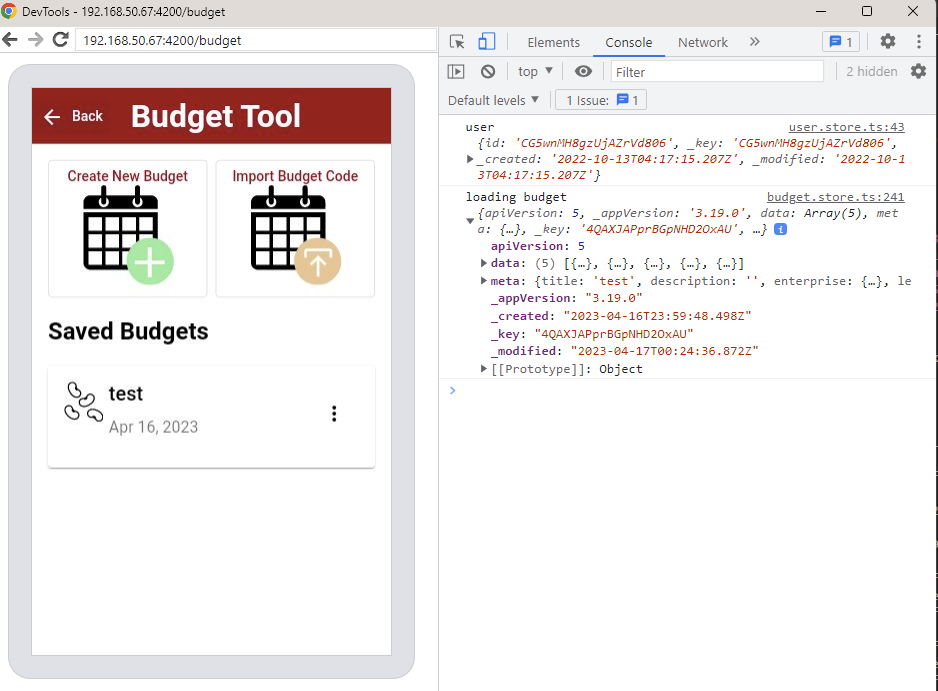

import { Callout } from "nextra-theme-docs";

# Device Testing

### Getting Started

The guide below assumes some knowledge or running android projects locally using Android Studio.

As a minimum you will need [Android Studio](https://developer.android.com/studio) installed, and a virtual or physical device connected.
More information can be found in the [Android Studio Documentation](https://developer.android.com/studio/run)

You will also need to populate a relevant `google-services.json` file, available from project admin.

### Running on a device

In order to run a local app on a native (or emulator) device with live-reload support both the device and local server need custom configuration.

Create a file at `apps/picsa-apps/extension-app-native/.env.local` and provide a `SERVER_URL` to match your local ipv4 address for the angular server.

This should usually be in the form: `192.xxx.xx.xx`, and append `:4200` port for the angular server.

```sh
SERVER_URL=http://192.xxx.xx.xx:4200
```

<Callout emoji="💡">
  **Tip** <br></br>On windows you can check your ip via command `ip config` and look
  for `IPv4` address for your internet adapter
</Callout>

Now run the utility script to update the app config and start the app server

```sh
yarn nx run picsa-apps-extension-app-native:serve
```

Run the app from android studio either on an emulator or physical device

The app should live reload both on local network and device

#### Troubleshooting

If the app shows a **Web Page Not Available** screen then should first check the app is running locally.
This can be done by visiting the url you specified in your local web browser, e.g. http://192.xxx.xx.xx:4200.

If the app is running in a local browser then you should check that the SERVER_URL has populated as expected.
You can do this by checking the generated file at  
`apps\picsa-apps\extension-app-native\android\app\src\main\assets\capacitor.config.json`

The output should include a block with the url specified from your environment file

```json
"server": {
		"androidScheme": "http",
		"cleartext": true,
		"url": "http://192.xxx.xx.x:4200"
	}
```

If the json configuration is as expected it may just be a case of reloading the app. If still not working seek out support.

### Inspecting Logs

Logs will appear in Android Studio logcat, or can be viewed in google chrome using the device inspector

`chrome://inspect/#devices`



Clicking on _inspect_ will launch devtools with access to full console logs



### Troubleshooting

Main common issues are outlined in the Capacitor Android Documentation:
https://capacitorjs.com/docs/android

There is also a dedicated troubleshooting page available at:
https://capacitorjs.com/docs/android/troubleshooting

A few other specific issues are outlined below:

#### Android Emulator Crashes

If the emulator is crashing during operation view the android studio logcat logs and try to debug error messages on stackoverflow.

If the emulator crashes during startup (with no log messages shown) recommended troubelshooting steps:

- Ensure you have the latest version of the emulator SDK installed from Android Studio
- Try running emulator from command line with verbose logging and without Vulkan UI

```sh
 emulator -avd "Pixel_API_33" -verbose -show-kernel -feature -Vulkan
```

- Review troubleshooting advice at: https://developer.android.com/studio/run/emulator-troubleshooting
- Review issues raised at: https://issuetracker.google.com/issues?q=componentid:192727

#### Webcomponents

There may be issue bundling webcomponents when running on device server.
The current workaround is simply to temporarily disable the custom elements, by commenting out the `defineCustomElements` declarations

```ts {4,8} showLineNumbers filename="libs/webcomponents-ngx/src/lib/webcomponents-ngx.module.ts"
import { CommonModule } from "@angular/common";
import { NgModule } from "@angular/core";
// Import and register all custom elements for the module
// import { defineCustomElements } from '@picsa/webcomponents/loader';

import { DIRECTIVES } from "./generated";

// defineCustomElements(window);

@NgModule({
  imports: [CommonModule],
  declarations: [...DIRECTIVES],
  exports: [...DIRECTIVES],
})
export class WebcomponentsNgxModule {}
```
