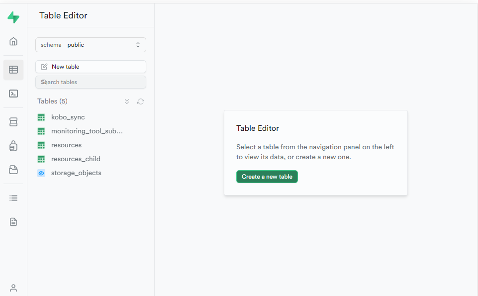
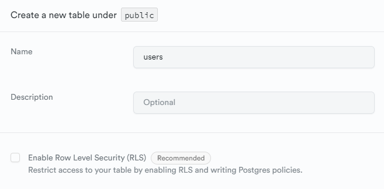
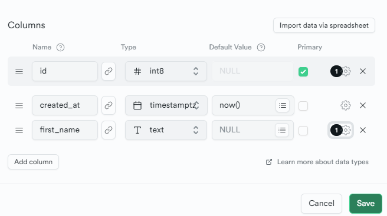
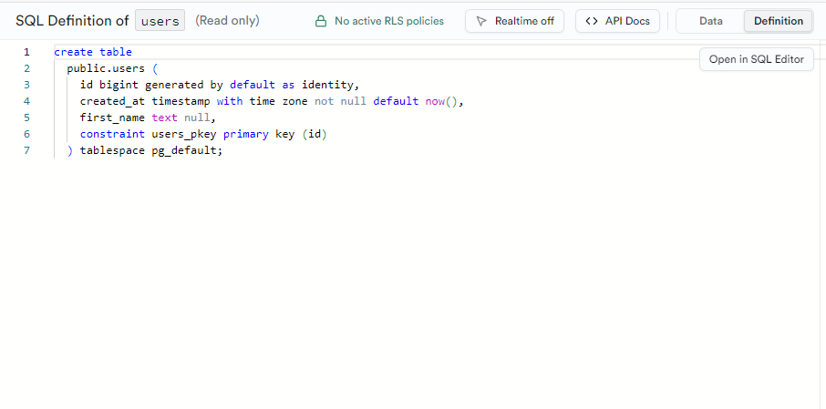
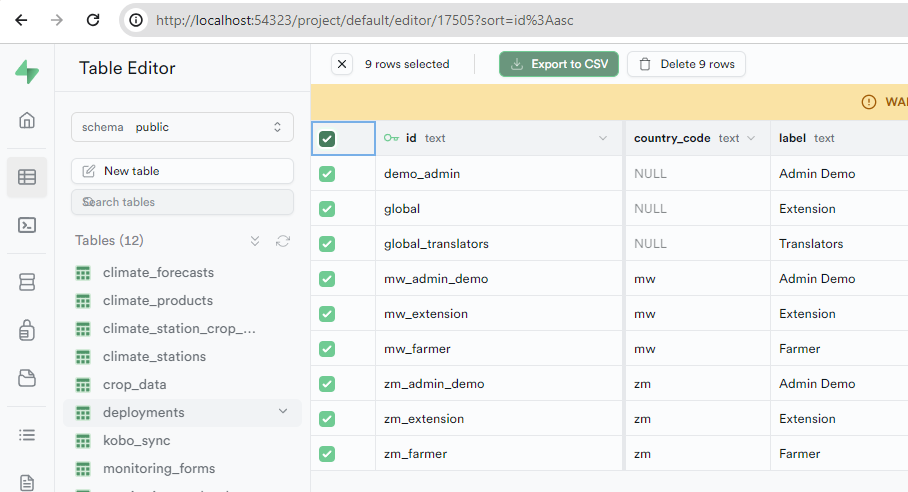

# Database

Supabase manages a Postgres database, accessible via the studio
https://supabase.com/docs/guides/database/overview

## Bootstrap

The database schema is defined within migration files that can be used both to bootstrap the database for first use, and to apply ongoing updates as required.

To fully initialise a clean database (wipe existing data and changes and repopulate seed data), use the reset command.

```sh
yarn nx run picsa-server:reset
```

To partially apply only new migrations (keep existing data and changes)

```sh
yarn nx run picsa-server:supabase migration up
```

To repopulate data from seed files run

```sh
yarn nx run picsa-server:seed
```

## Create tables

### Generate new table

This can be achieved interactively using the supabase studio (assumed running locally)  
http://localhost:54323/project/default/editor



For ease of testing, you will likely want to opt out of `Row Level Security`. Permissions can be configured at a later stage



### Define Schema

Using the interactive interface define data columns for your table



### Export definition

Once a table has been created, the definition needs to be stored to enable recreation on bootstrap and update.

1. Create a migration file to store the definition update.

```sh
yarn nx run picsa-server:supabase migration new [migration_name]
```

Providing a clear name for the migration. E.g. if creating a new table to store `users`:

```sh
yarn nx run picsa-server:supabase migration new users_table_create
```

This will populate a new file to `apps\picsa-server\supabase\migrations`.

2. Copy the table definition to the migration
   The definition can be found in the UI using the `Definition` tab in the top-right corner



### Export Seed Data

It is often useful to include some example data to use for development.

Any data that has been generated locally can be exported as CSV directly from the supabase dashboard.
Select rows for export and select **Export to CSV**.



This data should be placed in the `apps\picsa-server\supabase\data` folder.

Seed data can then be imported via

```sh
yarn nx run picsa-server:seed
```

## Advanced

### Generate DB types

Typescript type definitions can be generated from tables to use within application code.

```sh
yarn nx run picsa-server:gen-types
```

This will populate types to the `apps\picsa-server\supabase\types` folder.

These types can be imported in frontend code from the linked `@picsa/server-types` package, e.g.

```ts
import type { Database } from "@picsa/server-types";
```

Specific table definitions can be accessed from the types, e.g. the `users` table row definition would be available via

```ts
type IUserRow = Database["public"]["Tables"]["users"]["Row"];
```

### Push local changes to Server
First the local server must be linked to the production instance, using the production server id (ref)

```sh
yarn nx run picsa-server:supabase link --project-ref [ref]
```

Once linked, remote db schema can be pushed

```sh
supabase migration up --linked
```


### Pull server db

Changes from production server db can also be pulled locally

```sh
supabase db pull
```

This will create a single migration containing the full diff to match local db to server

If local and server are in sync you should see an output such as:

```
no schema changes found
```

## Troubleshooting

**`supabase link` fails - timeout**

- Check dashboard and ensure ip not banned
- Use supabase cli directly
- Pass password as var

```sh
cd apps/picsa-server
npx supabase login
npx supabase link --project-ref [ref] --password [pass]
```
