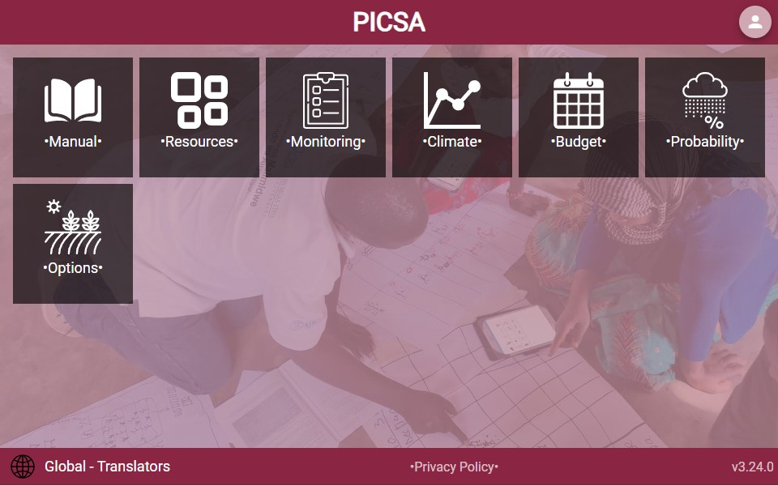

# Translations

The app uses [NGX-Translate](https://github.com/ngx-translate/core) to manage translations. See git documentation for full details, or summary docs below

## Setup

In order to work with translations the `PicsaTranslateModule` will need to be imported into the main app, and translation asset files copied using the `project.json`

as well as any component modules (to support lazy loading)

_app.module.ts_

```ts
import { PicsaTranslateModule } from '@picsa/i18n';
@NgModule({
  imports: [
    PicsaTranslateModule.forRoot(),
  ],
})
```

_project.json_

```json
{
  "assets": [
    {
      "glob": "*.json",
      "input": "libs/i18n/assets",
      "output": "assets/i18n"
    }
  ]
}
```

Additionally any lazy-loaded module should also directly import the shared `PicsaTranslateModule`

_component.module.ts_

```ts
import { PicsaTranslateModule } from '@picsa/i18n';
@NgModule({
  imports: [
    PicsaTranslateModule,
  ],
})
```

## Apply Translations

### Templates

In any `.html` document the `translate` pipe can be used to automatically translate any hardcoded strings

```html
</span>{{ 'This text will be translated' | translate}}</span>
<div *ngFor="let item of items">
  {{item.label | translate}}
</div>
```

```ts
items = [{ label: "hello" }, { label: "goodbye" }];

constructor(translateService:PicsaTranslateService){

}
```

**Warning**  
In the looped items example, strings will not automatically be detected for extraction
See below for method to add translation markers for hardcoded data

### Non-Templates

If the translated string will not be rendered, e.g. as part of an alert of other programmatic api such as setting climate chart title,
the `PicsaTranslateService` can be used to generate translations

```ts
import { PicsaTranslateService } from '@picsa/i18n';

constructor(translateService:PicsaTranslateService){}

async showAlert(msg:string){
  const translatedMsg = await this.translateService.translateText(msg)
  alert(msg)
}
```

## Extract Strings

Any workspaces containing translation data should first be listed in `libs\i18n-gen\src\hardcoded\index.ts`.
This will allow scripts to translate using [ngx-translate-extract(https://github.com/biesbjerg/ngx-translate-extract).

All strings marked with the translate pipe `{{ ... | translate}}` will automatically be extracted

Any text that is not marked with a translate pipe will need to be manually marked using the `translateMarker` utility

_component.ts_

```ts
import { marker as translateMarker } from "@biesbjerg/ngx-translate-extract-marker";

items = [
  { label: translateMarker("hello") },
  { label: translateMarker("goodbye") },
];
```

## Extract Source

Once translations have been marked they need to be extracted to send to translators. This can be done by the following script

```sh
yarn i18n:gen
```

Any extracted strings will be populated to template files located in `libs\i18n-gen\templates`, to share with translators.  
This template can be uploaded to the [PICSA Dashboard](https://dashboard.picsa.app) for translation

## Update Translations

Translated files can be exported from the [PICSA Dashboard](https://dashboard.picsa.app) and populated in the `libs/i18n/assets` folder

## Preview Translations

Whilst awaiting updates from translators it is still possible to view all text pending translation
(i.e. text that has been correctly configured for translation)

First ensure all translations have been updated via the `yarn i18n:gen` command  
Then run the app locally and specify the `Global - Translators` configuration

All text marked for translation will be indicated by `•{text}•`, e.g.


